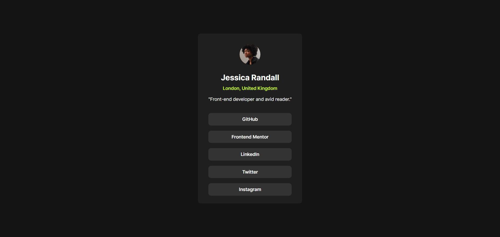
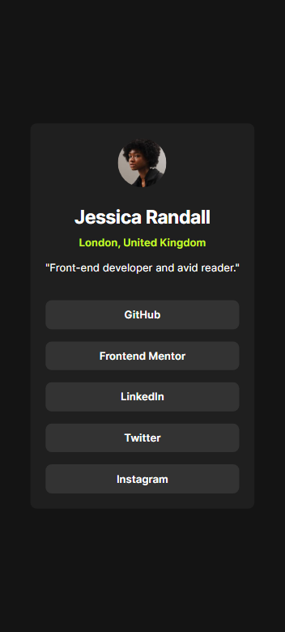

# Frontend Mentor - Social links profile solution

This is a solution to the [Social links profile challenge on Frontend Mentor](https://www.frontendmentor.io/challenges/social-links-profile-UG32l9m6dQ). Frontend Mentor challenges help you improve your coding skills by building realistic projects.

## Table of contents

- [Overview](#overview)
  - [The challenge](#the-challenge)
  - [Screenshot](#screenshot)
  - [Links](#links)
- [My process](#my-process)
  - [Built with](#built-with)
  - [What I learned](#what-i-learned)
- [Author](#author)

## Overview

### The challenge

Users should be able to:

- See hover and focus states for all interactive elements on the page

### Screenshot

Desktop view

Mobile view

### Links

- Solution URL: [Github repo](https://github.com/simeon2002/FEM-social-links-profile)
- Live Site URL: [Socials links profile component](https://social-links-profile-sim.netlify.app/)

## My process

First the semantic HTML structure created, then visual styles applied after which component layout was fixed as well as spacing.

### Built with

- Semantic HTML5 markup
- CSS custom properties
- Media queriess to adjust card padding for larger screen
- Mobile-first workflow

### What I learned

/

### Continued development

/

## Author

- Frontend Mentor - [@simeon2002](https://www.frontendmentor.io/profile/simeon2002)
- Twitter - [@SimeonSeraf1mov](https://x.com/SimeonSeraf1mov)
